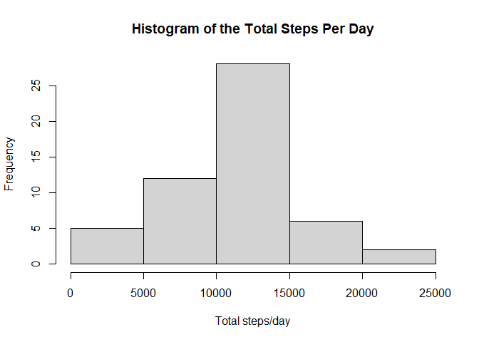
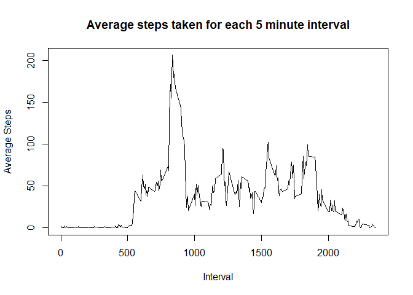
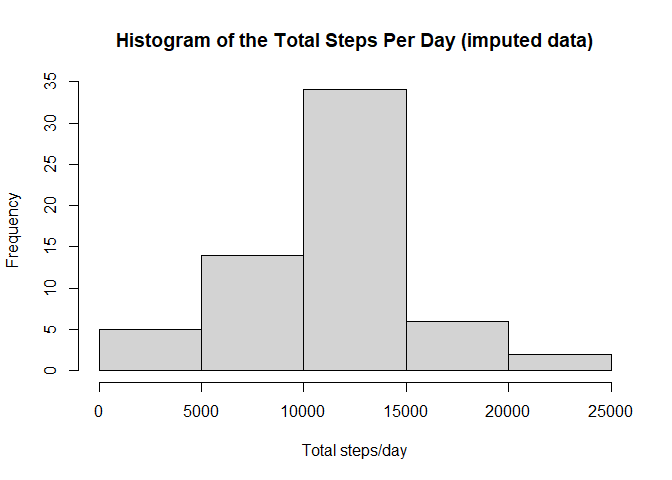
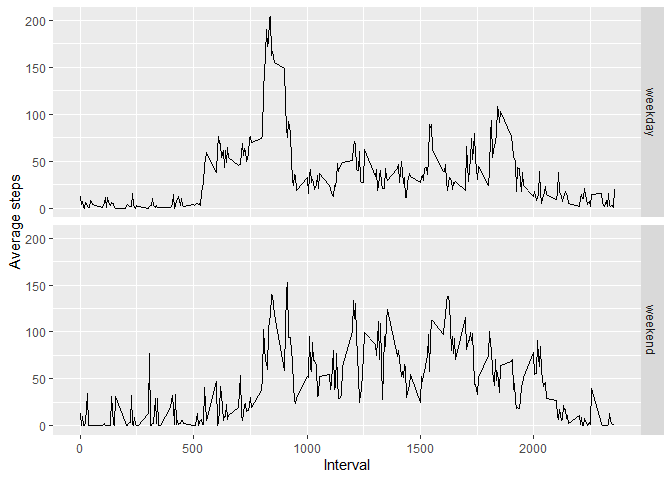

We'll start by loading the libraries.

```r
library(dplyr)
```

```
## Warning: package 'dplyr' was built under R version 4.1.3
```

```
## 
## Attaching package: 'dplyr'
```

```
## The following objects are masked from 'package:stats':
## 
##     filter, lag
```

```
## The following objects are masked from 'package:base':
## 
##     intersect, setdiff, setequal, union
```

```r
library(ggplot2)
```

```
## Warning: package 'ggplot2' was built under R version 4.1.3
```

## Loading and preprocessing the data
First we'll need to unzip the file before loading it into our environment:


```r
unzip("activity.zip")
raw_data <- read.csv("activity.csv")
summary(raw_data)
```

```
##      steps            date              interval     
##  Min.   :  0.00   Length:17568       Min.   :   0.0  
##  1st Qu.:  0.00   Class :character   1st Qu.: 588.8  
##  Median :  0.00   Mode  :character   Median :1177.5  
##  Mean   : 37.38                      Mean   :1177.5  
##  3rd Qu.: 12.00                      3rd Qu.:1766.2  
##  Max.   :806.00                      Max.   :2355.0  
##  NA's   :2304
```

```r
##Processing data to remove the NAs and convert date variable into date format
data <- raw_data[complete.cases(raw_data),]
data$date <- as.Date(data$date)
```

## What is mean total number of steps taken per day?

1. Create histogram of total number of steps taken each day


```r
# Create new dataframe that calculates total stepes per day
steps <- data %>% 
  group_by(date) %>% 
  summarise(Total = sum(steps))

# Draw Histogram of total steps per day
hist(steps$Total, 
     main = "Histogram of the Total Steps Per Day",
     xlab="Total steps/day")
```

<!-- -->

2. Calculate and report the **mean** and **median** total number of steps taken each day


```r
# Calculate the mean and median steps
paste("The mean is", mean(steps$Total))
```

```
## [1] "The mean is 10766.1886792453"
```

```r
paste("The median is", median(steps$Total))
```

```
## [1] "The median is 10765"
```


## What is the average daily activity pattern?
1. Make a time series plot of the 5-minute interval (x-axis) and the average number of steps taken, averaged across all days (y-axis)


```r
# Create new dataframe that averages steps from each 5-minute interval across the days
interval <- data %>% 
  group_by(interval) %>% 
  summarise(average = mean(steps))

# Draw time-series plot

plot(interval$interval, interval$average,
     main = "Average steps taken for each 5 minute interval",
     xlab = "Interval",
     ylab = "Average Steps",
     type = "l")
```

<!-- -->


2. Which 5-minute interval, on average across all the days in the dataset, contains the maximum number of steps?


```r
paste("The interval with the highest number of steps is", interval$interval[which.max(interval$average)])
```

```
## [1] "The interval with the highest number of steps is 835"
```


## Imputing missing values

There are a number of days and intervals that are missing (coded as NA) which may introduce bias.

1. Calculate and report the total number of missing values in the dataset (i.e., the total number of rows with NAs)


```r
paste("the total number of missing values is", sum(is.na(raw_data)))
```

```
## [1] "the total number of missing values is 2304"
```

2. Devise a strategy for filling in all of the missing values in the dataset. The strategy does not need to be sophisticated. For example, you could use the mean/median for that day, or the mean for that 5-minute interval etc. 

To reduce the risk of biasing our dataset, NAs will be replaced randomly (i.e., simple random imputation) from the existing data following the methods outlined in [Chapter 25: Missing Data Imputation](https://lgreski.github.io/datasciencedepot/references/missingValueImputation-Gelman.PDF) from the reference book *Data Analysis Using Regression and Multilevel/Hierarchical Models* by Andrew Gelman and Jennifer Hill.

3. Create a new dataset with missing data filled in.

For consistency, I will set the seed in the function so it will always generate a specific random dataset.


```r
# Create function that will randomly impute data for a single vector/variable:

random.imp <- function(a){
  set.seed(1)
  missing <- is.na(a)
  n.missing <- sum(missing)
  a.obs <- a[!missing]
  imputed <- a
  imputed[missing] <- sample(a.obs, n.missing, replace=TRUE)
  return(imputed)
}

# Create new dataset with missing data filled in
imputed_data <- raw_data
imputed_data$steps <- random.imp(raw_data$steps)
summary(imputed_data)
```

```
##      steps            date              interval     
##  Min.   :  0.00   Length:17568       Min.   :   0.0  
##  1st Qu.:  0.00   Class :character   1st Qu.: 588.8  
##  Median :  0.00   Mode  :character   Median :1177.5  
##  Mean   : 37.19                      Mean   :1177.5  
##  3rd Qu.: 12.00                      3rd Qu.:1766.2  
##  Max.   :806.00                      Max.   :2355.0
```

```r
# Convert date variable into correct format
imputed_data$date <- as.Date(imputed_data$date)
```


3. Make a histogram of the total number of steps taken each day and calculate and report the **mean** and **median** total number of steps taken each day. Do these values differ from the estimates from the first part of the assignment? What is the impact of imputing missing data on the estimates of the total daily number of steps?


```r
# Create new dataframe that calculates total steps for each day
imputed_steps <- imputed_data %>% 
  group_by(date) %>% 
  summarise(Total = sum(steps))

# Draw Histogram with 
hist(imputed_steps$Total, 
     main = "Histogram of the Total Steps Per Day (imputed data)",
     xlab="Total steps/day")
```

<!-- -->

```r
# Calculate the mean and median steps
paste("The mean is", mean(imputed_steps$Total))
```

```
## [1] "The mean is 10709.9180327869"
```

```r
paste("The median is", median(imputed_steps$Total))
```

```
## [1] "The median is 10765"
```


The mean and median values will be slightly different from the original values but whether it will be higher or lower than the first dataset that excluded missing values would be randomly determined by the imputation function. In this particular case, I set the seed so it will always generate this random dataset. The imputed mean is slightly lower than the original dataset but the medians are identical across the non-imputed and imputed data.


## Are there differences in activity patterns between weekdays and weekends?


1. Create a new factor variable in the dataset with two levels -- "weekday" and "weekend" indicating whether a given date is a weekday or weekend day. 


```r
# Create new variables for days of the week and factor variable categorising weekdays and weekend.
imputed_data$day <- weekdays(imputed_data$date)
imputed_data$daytype <- "weekday"
imputed_data$daytype[imputed_data$day %in% c("Saturday", "Sunday")] <- "weekend"
```


2. Make a panel plot containing a time series plot (i.e., type = "l") of the 5-minute interval (x-axis) and the average number of steps taken, averaged across all weekdays or weekend days (y-axis).


```r
# Create new dataframe that averages steps from each 5-minute interval across day types (weekday and weekend)
day_interval <- imputed_data %>% 
  group_by(daytype, interval) %>% 
  summarise(avgstep = mean(steps))
```

```
## `summarise()` has grouped output by 'daytype'. You can override using the
## `.groups` argument.
```

```r
# Draw panel plots
qplot(interval, avgstep, data=day_interval,
      geom = "line",
      xlab="Interval",
      ylab="Average steps",
      facets =daytype ~ .)
```

```
## Warning: `qplot()` was deprecated in ggplot2 3.4.0.
```

<!-- -->


